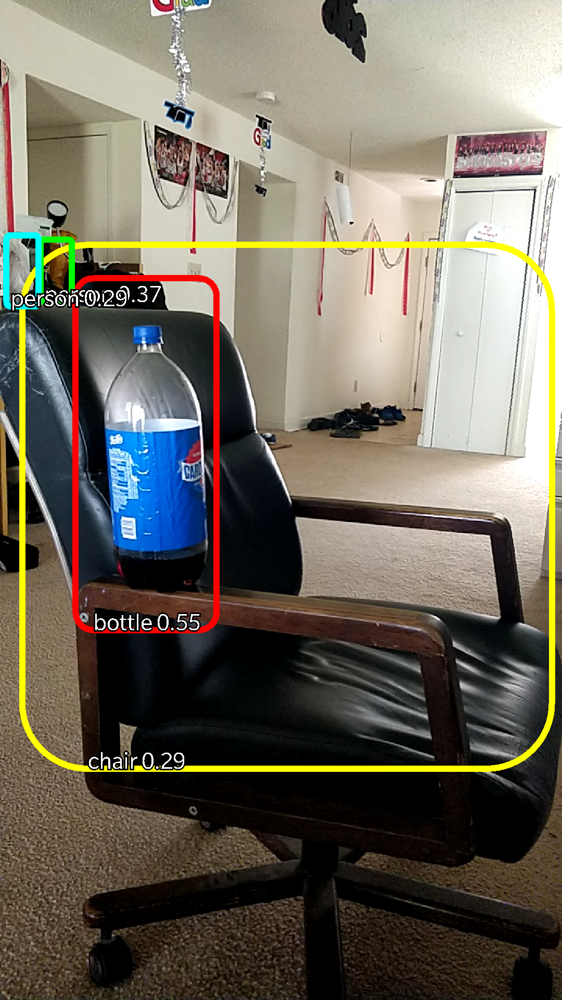
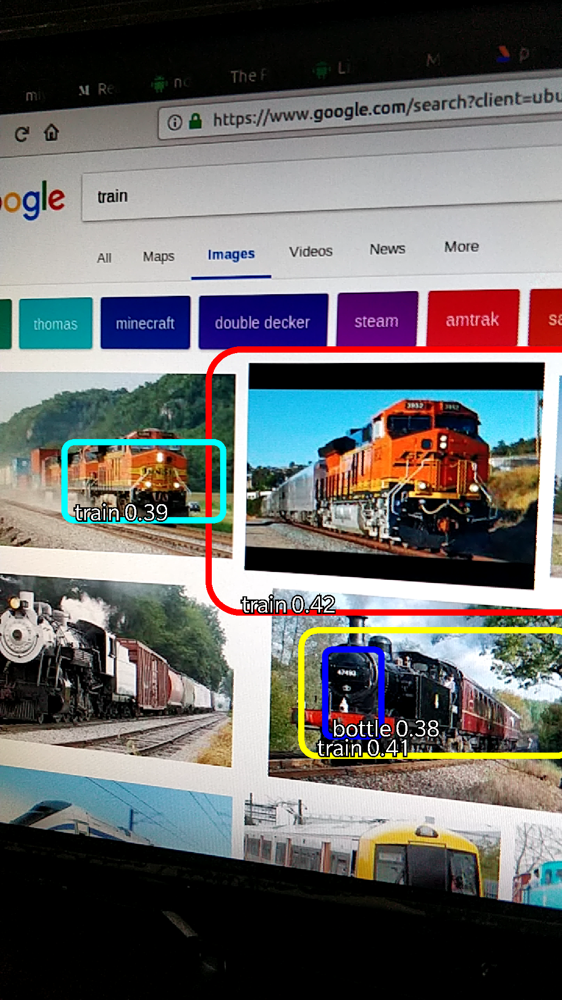
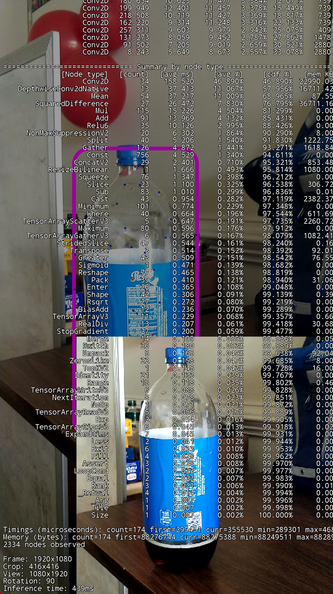

# Eyedentifier - Android App

Introduction
-------------

The app currently builds on `ssd-mobilenet` and `YOLO`. The models have been trained on Pascal VOC 2012 with `20 classes`.

Requirments
-----------
 
* Android Studio (3.1.2)
* Android SDK (API level 27)
* Android mobile (running at least 5.0 - Lollipop)
* Android NDK (v 16.1.4479499)
* CMake
 
Compilation Instructions
------------------------

To run the app through Android studio, you need to enable ADB debugging:

1. Go to Mobile's Settings > About Phone
2. Scroll down to `build number` and tap on it continuously for 8 times (You'll get a toat `you are now a developer`)
3. Go back to Settings > Developer Options (This would have been hidden previously)
4. Scroll down to `ADB Debugging` and turn it on

To run the project in Android Studio:

1. Import `Android App` folder in Android Studio
2. Plugin your Android mobile
3. Click on the `Run App` button (Similar to Play button)
4. Click on your mobile device and click `Run`
5. Wait for the gradle build and the app will be installed in your mobile

**App Names:** `TF Object Detection` and `Yolo Detection`

**NOTE:**
* The app compiles against latest SDK: `27`
* Min SDK Version required: `21` (since Tensorflow is supported for APIs >=21)
* The app builds `libtensorflow_eyedentifier.so` - the JNI interface for Object Tracking - for `x86`, `armeabi-v7a`, `arm64-v8a` and `x86_64` using `cmake`
*`libtensorflow_inference.so` - JNI interface for Tensorflow - is downloaded as a dependency in gradle
* Edit [build.gradle](app/build.gradle) to modify any of the above properties

Screenshots
-----------

   

License
-------

	MIT License

	Copyright (c) 2018 Dinesh Prasanth M K

	Permission is hereby granted, free of charge, to any person 
	obtaining a copy of this software and associated documentation 
	files (the "Software"), to deal in the Software without 
	restriction, including without limitation the rights to use, 
	copy, modify, merge, publish, distribute, sublicense, and/or 
	sell copies of the Software, and to permit persons to whom the 
	Software is furnished to do so, subject to the following conditions:

	The above copyright notice and this permission notice shall be 
	included in all copies or substantial portions of the Software.

	THE SOFTWARE IS PROVIDED "AS IS", WITHOUT WARRANTY OF ANY KIND, 
	EXPRESS OR IMPLIED, INCLUDING BUT NOT LIMITED TO THE WARRANTIES 
	OF MERCHANTABILITY, FITNESS FOR A PARTICULAR PURPOSE AND 
	NONINFRINGEMENT. IN NO EVENT SHALL THE AUTHORS OR COPYRIGHT
	HOLDERS BE LIABLE FOR ANY CLAIM, DAMAGES OR OTHER LIABILITY, 
	WHETHER IN AN ACTION OF CONTRACT, TORT OR OTHERWISE, ARISING FROM, 
	OUT OF OR IN CONNECTION WITH THE SOFTWARE OR THE USE OR OTHER 
	DEALINGS IN THE SOFTWARE.